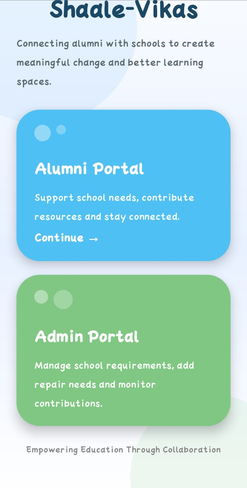
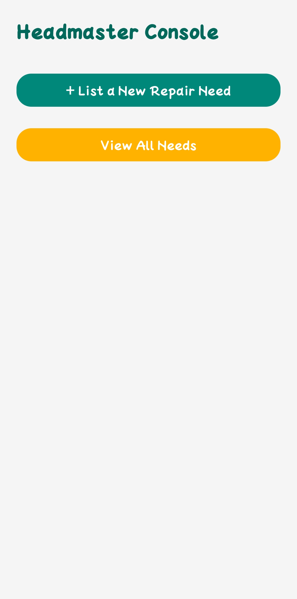
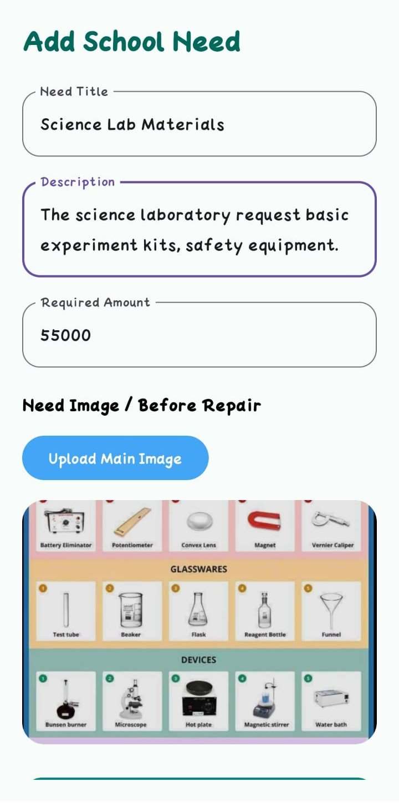
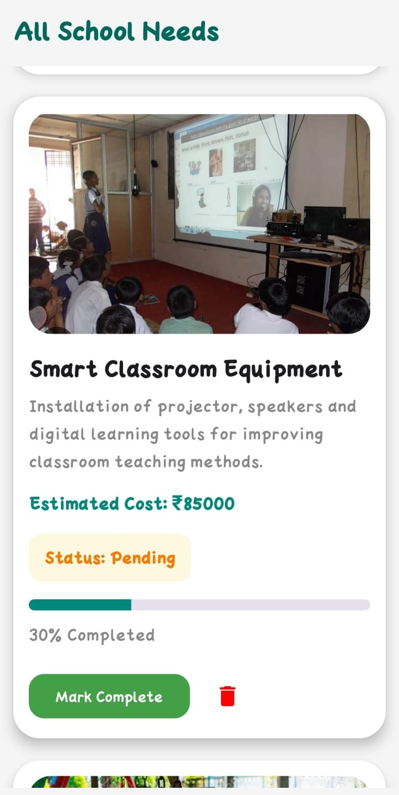
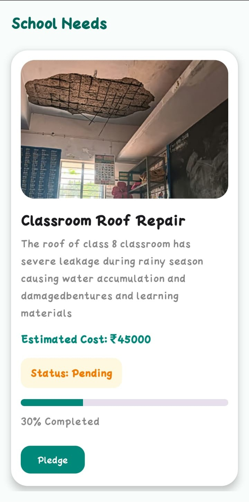
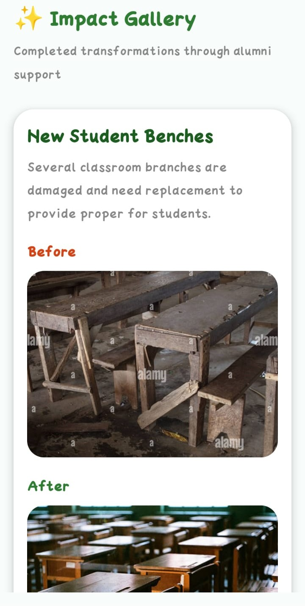
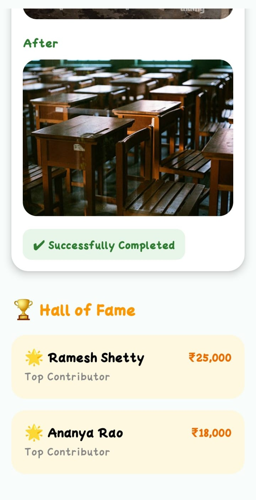

# 🌱 Shaale-Vikas Android App

## 🏢 Internship Experience

Developed during my Android Development Internship at MindMatrix.io, where I worked on UI design, Firebase integration, and real-time application development.

## 📌 About the Project

Shaale-Vikas is an Android application designed to connect school administrations with alumni to support infrastructure and repair needs.

The platform enables:
- Schools to list required repairs or improvements
- Alumni to view and contribute support
- Transparent tracking of progress using before/after updates

The goal is to create a community-driven system for improving educational environments.

## ✨ Features

### 👨‍🎓 Alumni Module
- View school requirements
- Pledge support for needs
- Track completed improvements
- View completed transformations through the Impact Gallery (Before vs After images)
- Explore Hall of Fame showcasing top contributors and supporters

### 🏫 Admin Module
- Add new school needs
- Upload requirement images
- Mark tasks as completed with proof

### 📊 System Features
- Firebase Authentication
- Local data storage using SharedPreferences
- Image handling using device storage
- Real-time UI updates using Jetpack Compose

  ## 🛠 Tech Stack

- Kotlin (Android Development)
- Jetpack Compose (UI)
- Firebase Authentication
- Gson (JSON parsing)
- Coil (Image loading)
- SharedPreferences (local storage)
- Material 3 UI

  ## Screenshots

### Welcome Screen

### Admin Console

### Adding School Needs

### View School Needs

### Alumni Dashboard

### ImpactGallery

### Hall of Fame

